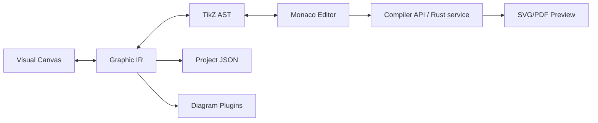

# TikzForge

TikzForge is an open-source Visual LaTeX Scientific Diagram IDE. It combines a Figma-like SVG
canvas with a TikZ/PGFPlots editor while keeping a LaTeX-independent Graphic IR as the single
source of truth.

> Status: a working, local-first MVP with an extensible foundation for all planned phases.

## Project overview

The MVP supports rectangle, text, circle and ellipse nodes, arrows, drag/resize, multi-selection,
grid snapping, property editing, undo/redo, project save/load, TikZ round-tripping, syntax
diagnostics, fast SVG preview, export, templates, PGFPlots data, local AI generation and diagram
plugins. Unsupported TikZ is preserved as a read-only `raw-tikz` element.

## Architecture



The browser never treats the TikZ source as its domain model. Canvas actions mutate IR, and only
the statements of changed elements are rewritten, so your formatting, comments and unsupported TikZ
stay exactly as you typed them. Valid editor changes are parsed back into IR. Invalid edits retain
the last valid canvas state and surface diagnostics.

## Screenshots

The repository intentionally keeps this placeholder until the UI has a stable release capture:
`docs/assets/studio-placeholder.svg`.

## Installation

Requirements: Node.js 20+, npm 10+, and Rust 1.82+ for the optional compiler service.

```bash
npm install
npm run dev
```

Open <http://localhost:3000>. The first run uses the deterministic fast SVG renderer, so a local
TeX installation is not required.

## Development

```bash
npm run typecheck
npm run test:unit
npm run build
npm run lint
cargo test --workspace
```

The Next.js app is an App Router client shell. Monaco is loaded client-only because it depends on
browser globals. Public render and generation endpoints live under `apps/web/src/app/api`.

## Docker

```bash
docker compose up --build
```

The compose file starts the web app on <http://localhost:3000> and a Rust compiler service with
Tectonic and an offline package cache built into its image, so previews are real LaTeX output with
no extra setup. The first image build downloads Tectonic and its packages; after that the compiler
container runs without network access, as a non-root user, with a read-only filesystem and no shell
escape. If the compiler is unavailable, the web app falls back to its fast SVG preview, and the
preview panel shows which renderer produced the image. See [docs/compiler.md](docs/compiler.md).

Outside Docker, the web app uses only the fast renderer unless `COMPILER_SERVICE_URL` is set.

## Usage

1. Choose a component in the left sidebar, or start from a template.
2. Select and drag elements on the canvas; edit dimensions and styles in the inspector.
3. Use the TikZ editor to make source changes. Valid supported subset edits update the canvas.
4. Compile for a preview (real LaTeX when the compiler service is running, otherwise the fast SVG
   renderer), then export TikZ, LaTeX, SVG, PNG or project JSON.
5. Use the AI panel to generate editable IR, not a flattened image.

## Supported TikZ subset

The parser is a bounded subset parser, not a TeX engine. These become editable canvas elements:

- `\node` and `\coordinate` with options, names and `at` in any order; cartesian, polar and
  simple arithmetic coordinates; `right=2cm of A`-style positioning; `\draw ... rectangle`,
  `circle` and `ellipse` shapes.
- Edges between named nodes: `--`, `-|`, `|-`, `to[bend left=...]` and `.. controls ..`, with
  anchors (`A.north east`), arrow tips (`->`, `<->`, `-Stealth`, ...) and one label node.
- Named styles and `every node/.style` from `\begin{tikzpicture}[...]` or `\tikzset`, plus
  `node distance`; colors (xcolor mixes such as `blue!20`), fonts, line widths and sizes.
- A PGFPlots `axis` with one `\addplot coordinates` or `\addplot {expression}`.

Canvas coordinates are converted at 50 px per cm with y pointing up in TikZ. Plain TikZ exports
need `\usetikzlibrary{arrows.meta,calc,positioning,shapes.geometric,fit,backgrounds}` (the LaTeX
export includes it).

## Unsupported TikZ

Everything else, such as `\foreach`, `scope`, `\newcommand`, arcs, `\matrix`, or axes with several
plots, is kept verbatim as a read-only `raw-tikz` block. It is compiled and exported unchanged and
is never rewritten. When its shapes can be computed safely (literal `\foreach` lists, shifted
scopes, coordinate paths), the canvas shows a read-only preview of them.

## Roadmap

See [docs/roadmap.md](docs/roadmap.md) for the Phase 1–14 implementation map and the remaining
production steps.

## License

MIT. See [LICENSE](LICENSE).
