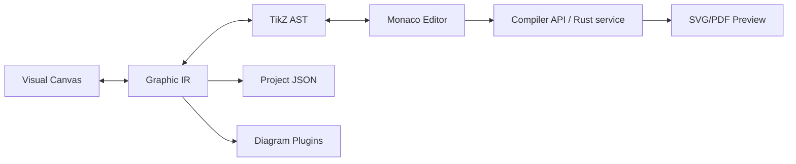

# TikzForge

TikzForge is an open-source Visual LaTeX Scientific Diagram IDE. It combines a Figma-like SVG
canvas with a TikZ/PGFPlots editor while keeping a LaTeX-independent Graphic IR as the single
source of truth.

> Status: a working, local-first MVP with an extensible foundation for all planned phases.

## Project overview

The MVP supports rectangle, text, circle and ellipse nodes, arrows, drag/resize, multi-selection,
grid snapping, property editing, undo/redo, project save/load, TikZ round-tripping, syntax
diagnostics, fast SVG preview, export, templates, PGFPlots data, local AI generation and diagram
plugins. Unsupported TikZ is preserved as a read-only `raw-tikz` element.

## Architecture



The browser never treats the TikZ source as its domain model. Canvas actions mutate IR, IR is
serialized into TikZ, and valid editor changes are parsed back into IR. Invalid edits retain the
last valid canvas state and surface diagnostics.

## Screenshots

The repository intentionally keeps this placeholder until the UI has a stable release capture:
`docs/assets/studio-placeholder.svg`.

## Installation

Requirements: Node.js 20+, npm 10+, and Rust 1.82+ for the optional compiler service.

```bash
npm install
npm run dev
```

Open <http://localhost:3000>. The first run uses the deterministic fast SVG renderer, so a local
TeX installation is not required.

## Development

```bash
npm run typecheck
npm run test:unit
npm run build
npm run lint
cargo test --workspace
```

The Next.js app is an App Router client shell. Monaco is loaded client-only because it depends on
browser globals. Public render and generation endpoints live under `apps/web/src/app/api`.

## Docker

```bash
docker compose up --build
```

The compose file starts the web app and an optional Rust compiler service. Compilation is disabled
by default in the web app unless `COMPILER_SERVICE_URL` is configured. The compiler container is
designed to run Tectonic without shell escape, network access, or access to the host filesystem.

## Usage

1. Choose a component in the left sidebar, or start from a template.
2. Select and drag elements on the canvas; edit dimensions and styles in the inspector.
3. Use the TikZ editor to make source changes. Valid supported subset edits update the canvas.
4. Compile for a fast SVG preview, then export TikZ, LaTeX, SVG or project JSON.
5. Use the AI panel to generate editable IR, not a flattened image.

## Supported TikZ subset

The parser intentionally covers a safe, documented subset: `\\node`, `\\coordinate`, `\\draw`,
`\\path`, `\\fill`, `\\filldraw`, and `\\clip`; absolute coordinates, node references,
relative positioning, style options, lines, arrows, rectangles, circles, ellipses and simple
Bézier paths. A small PGFPlots subset supports `axis` and `addplot coordinates`.

## Unsupported TikZ

TeX macro expansion, `\\foreach`, `\\newcommand`, conditionals, arbitrary PGF math and unknown
commands become `raw-tikz` blocks. Their source is preserved for compilation/export and they are
marked non-editable on the canvas.

## Roadmap

See [docs/roadmap.md](docs/roadmap.md) for the Phase 1–14 implementation map. Compiler sandbox
hardening, incremental source patches and browser WASM compilation are the next production steps.

## License

MIT. See [LICENSE](LICENSE).
