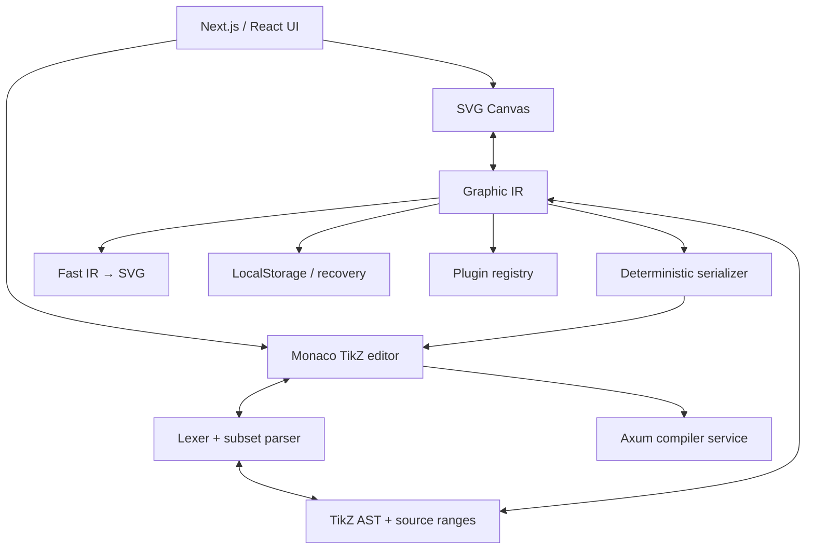

# TikzForge architecture

TikzForge is a local-first monorepo. The Graphic IR owns the document; all rendering surfaces are
adapters around it.

## Boundaries

- `packages/graphic-ir`: domain types, validation, coordinate conversion, layout and project
  operations. It has no LaTeX dependency.
- `packages/tikz-ast`: source-mapped AST and token types.
- `packages/tikz-parser`: bounded lexer/parser and IR conversion. Unknown TeX is a raw block.
- `packages/tikz-serializer`: stable human-readable source generation and source maps.
- `packages/svg-renderer`: safe deterministic fast preview.
- `packages/tikz-language-service`: completion, snippets, formatter and diagnostics consumed by
  Monaco.
- `packages/plugin-system`: parser/serializer/renderer/inspector/completion contract.
- `apps/web`: client UI and public API routes. Server components remain thin; interactive state is
  isolated behind explicit `use client` boundaries.
- `apps/compiler-server`: optional Rust service. It rejects dangerous input, runs without shell
  invocation, bounds source/time, and can call a trusted Tectonic binary only in a locked-down
  container.

## Synchronization

Canvas actions update IR and serialize the whole supported picture. Source edits are debounced,
parsed and validated. A failed parse does not replace `project`; it only updates diagnostics. This
avoids cursor jumps, infinite loops and canvas loss. AST source ranges are retained for the future
incremental patch implementation.

## State ownership

- `project-store`: project, source, selection and command-style history.
- `ui-store`: view transform and modal state.
- `compiler-store`: compile lifecycle, preview and errors.

Persistent state is project JSON; TikZ is always exportable and visible.
